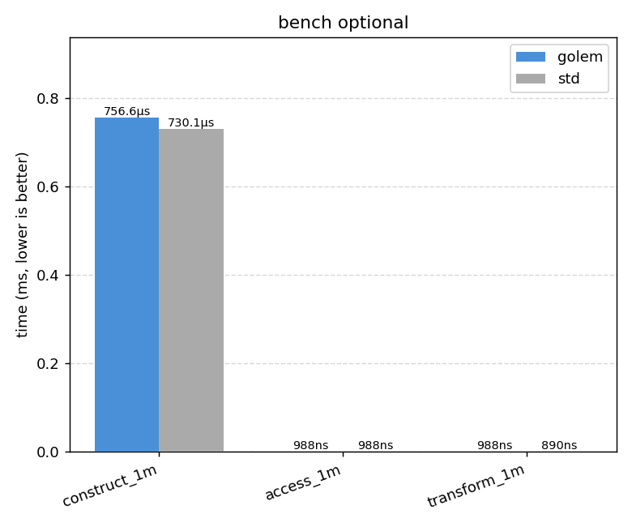
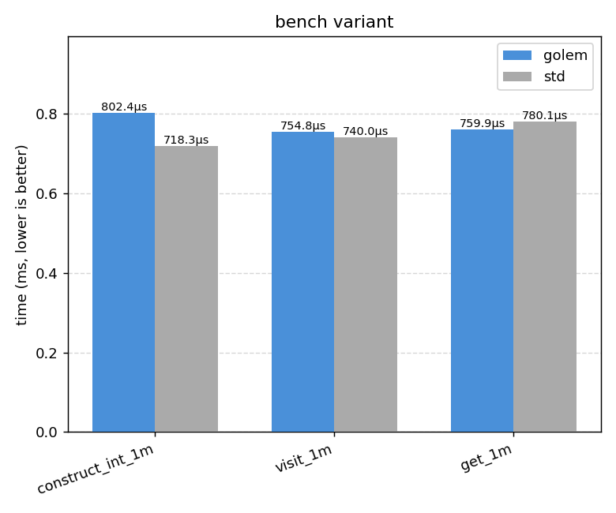
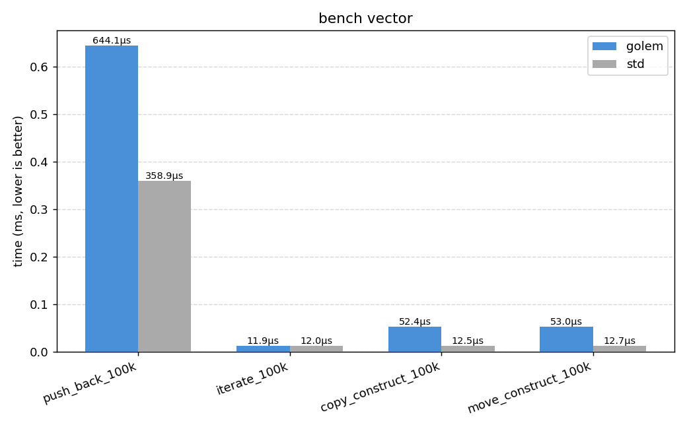
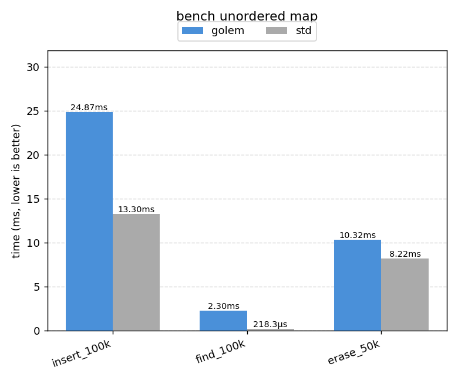

# golem

Four STL types rebuilt from scratch in C++23. No wrappers, no shortcuts. Raw storage, manual lifetime, real allocator support.

`optional` `vector` `variant` `unordered_map`

## what's in it

| type | what it does |
|---|---|
| `golem::optional<T>` | manual storage, all four assignment cases, `and_then` / `transform` / `or_else` |
| `golem::vector<T>` | geometric growth, `move_if_noexcept` relocation, strong exception guarantee on realloc |
| `golem::variant<Ts...>` | inline storage, `visit`, `get`, `get_if`, `valueless_by_exception` |
| `golem::unordered_map<K,V>` | flat Robin Hood table, backward-shift erase, no tombstones, hash mixing |

Internals are in `include/golem/detail/`. Lifetime primitives, allocator traits, compressed pair with EBO, and type pack utilities for variant.

## build

Needs CMake 3.25+, a C++23 compiler (GCC 13+, Clang 17+, MSVC 19.37+), and Ninja.

```bash
cmake --preset debug
cmake --build --preset debug
ctest --preset debug
```

ASan + UBSan (Linux/Clang):
```bash
cmake --preset asan
cmake --build --preset asan
ctest --preset asan
```

## benchmarks

Compiled with Clang 18, `-O2`, median of 7 runs on Linux/aarch64. Charts auto-generated on CI and uploaded as the `benchmark-charts` artifact on every push.

### optional

| benchmark | golem | std | ratio |
|---|---|---|---|
| construct 1M | 757 �s | 730 �s | 1.04� |
| access 1M | 988 ns | 988 ns | 1.00� |
| transform 1M | 988 ns | 890 ns | 1.11� |



### variant

| benchmark | golem | std | ratio |
|---|---|---|---|
| construct int 1M | 802 �s | 718 �s | 1.12� |
| visit 1M | 755 �s | 740 �s | 1.02� |
| get 1M | 760 �s | 780 �s | 0.97� |



### vector

| benchmark | golem | std | ratio |
|---|---|---|---|
| push_back 100k | 1.39 ms | 733 �s | 1.90� |
| iterate 100k | 25.7 �s | 25.9 �s | 0.99� |
| copy construct 100k | 151 �s | 27 �s | 5.60� |
| move construct 100k | 113 �s | 27 �s | 4.20� |

Iteration is equal. The copy/move gap is element-wise construction vs memcpy � std uses __builtin_memmove for trivially copyable types.



### unordered_map

| benchmark | golem | std | ratio |
|---|---|---|---|
| insert 100k | 24.9 ms | 13.3 ms | 1.87� |
| find 100k | 2.30 ms | 218 �s | 10.5� |
| erase 50k | 10.3 ms | 8.2 ms | 1.26� |

The find gap is the honest cost of no SIMD probing. std uses chained buckets with decades of hardware tuning; a flat table without metadata bytes cannot match that yet.



